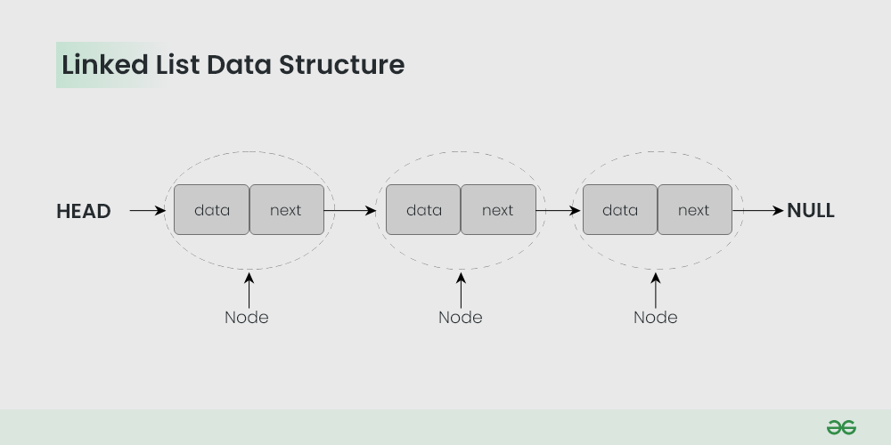

# List

- Array-based list
- Linked list
- Doubly linked list
- Circular linked list
- Skip list

## General constraints

### Array-based List

#### Time Complexity

|Operation|Worst Case|Average Case|
| --- | --- | --- |
|Search|O(n)|O(n)|
|Insertion|O(n)|O(1)|
|Deletion|O(n)|O(n)|

Insertion is O(n) if the array is full and needs to be resized.

Deletion is O(n) in all cases because the array needs to be shifted.

#### Space Complexity

O(n)

### Linked List

A linked list is a linear data structure, in which the elements are not stored at contiguous memory locations. The elements in a linked list are linked using pointers as shown in the below image:

## References

<https://www.geeksforgeeks.org/data-structures/linked-list/?ref=lbp>
