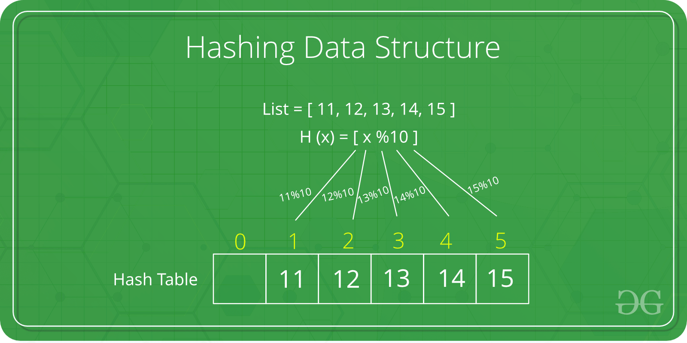

# Map

Map data structure (also known as a dictionary, associative array, or hash map) is defined as a data structure that stores a collection of key-value pairs, where each key is associated with a single value.

- Hash map (hash table)
- Tree map
- Linked hash map
- Trie map
- Bloom filter map

## Hash map

The Hash table data structure stores elements in key-value pairs where

- Key: unique integer that is used for indexing the values
- Value: data that are associated with keys.

### Hashing

Hashing is a technique of mapping a large set of arbitrary data to tabular indexes using a hash function. It is a method for representing dictionaries for large datasets.

A good hashing function should have the following properties:

- It should be efficiently computable, say in constant time and using simple arithmetic
operations.
- It should produce few collisions. Two additional aspects of a hash function implied by
this are:
- It should be a function of every bit of the key (otherwise keys that differ only in
these bits will collide)
- It break up (scatter) naturally occurring clusters of key values.

It allows lookups, updating and retrieval operation to occur in a constant time i.e. O(1).

#### Hash Collision

A collision occurs when a hash function generates the same key for two or more values. There are two ways to handle collisions:

- Separate chaininsg
- Linear probing

#### Time Complexity

|Operation|Worst Case|Average Case|
| --- | --- | --- |
|Search|O(n)|O(1)|
|Insertion|O(n)|O(1)|
|Deletion|O(n)|O(1)|

#### Space Complexity

O(n)

## References

<https://www.programiz.com/dsa/hash-table>

<https://www.programiz.com/dsa/hashing>

<https://www.geeksforgeeks.org/introduction-to-map-data-structure-and-algorithm-tutorials/>

<https://www.cs.umd.edu/class/fall2019/cmsc420-0201/Lects/lect10-hash-basics.pdf>

<https://www.geeksforgeeks.org/separate-chaining-collision-handling-technique-in-hashing/>

<https://www.geeksforgeeks.org/open-addressing-collision-handling-technique-in-hashing/>

(Chapter 8 - Hashing) Michael McMillan - Data Structures and Algorithms with JavaScript - Bringing classic computing approaches to the Web - O'Reilly Media (2014)
