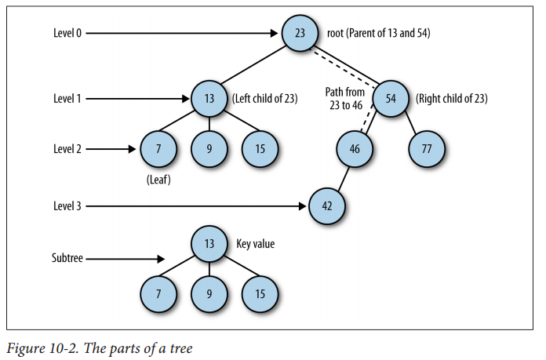

# Tree

Tree Data Structure is a hierarchical data structure in which a collection of elements known as nodes are connected to each other via edges such that there exists exactly one path between any two nodes.

- Binary tree
- Binary search tree
- AVL tree
- Red-black tree
- Splay tree
- B-tree

## References

<https://www.geeksforgeeks.org/introduction-to-map-data-structure-and-algorithm-tutorials/>
